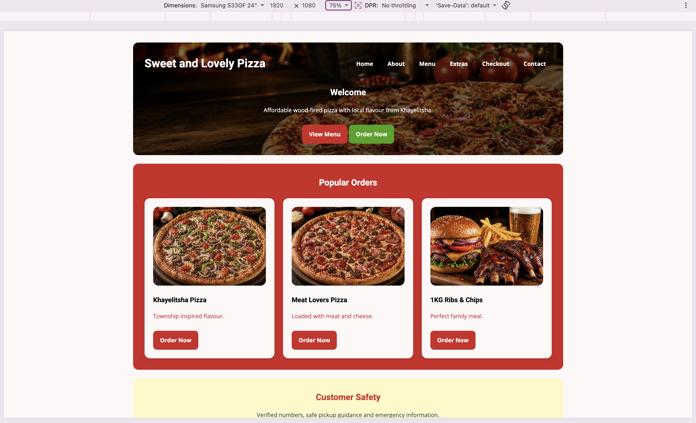
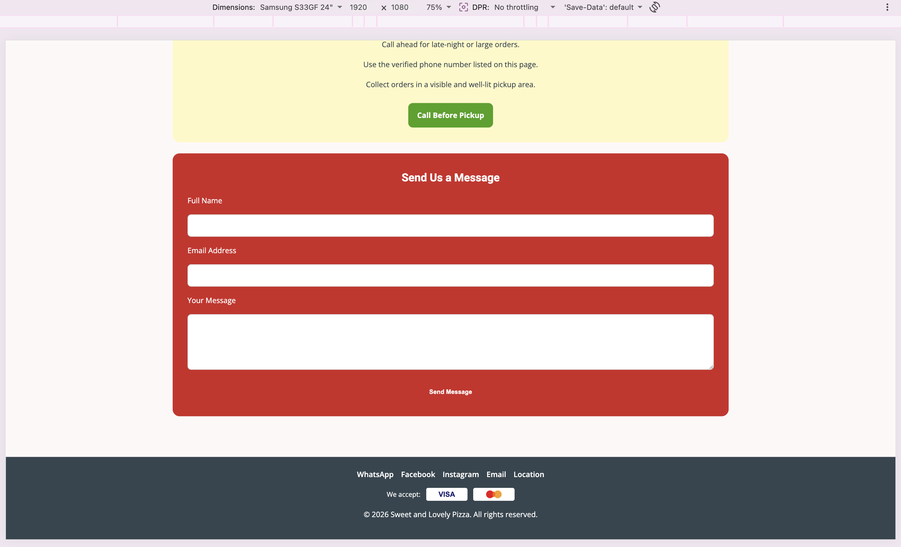
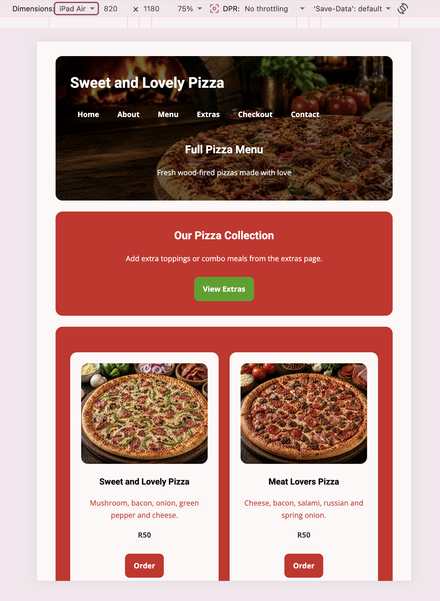
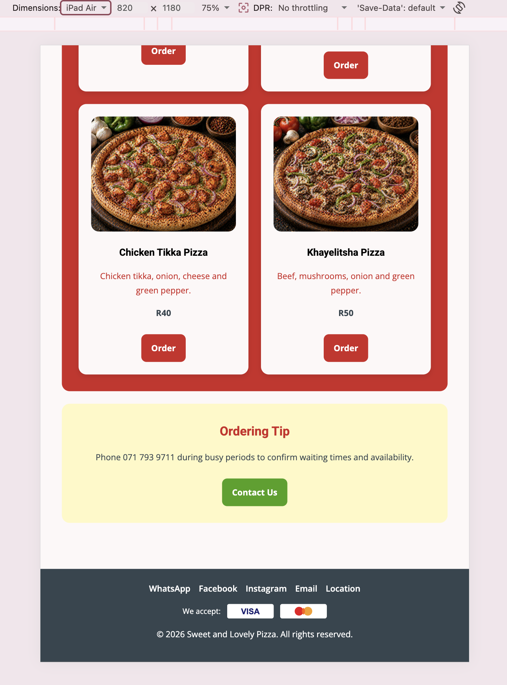
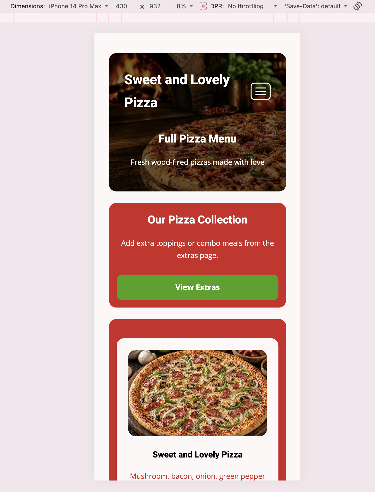
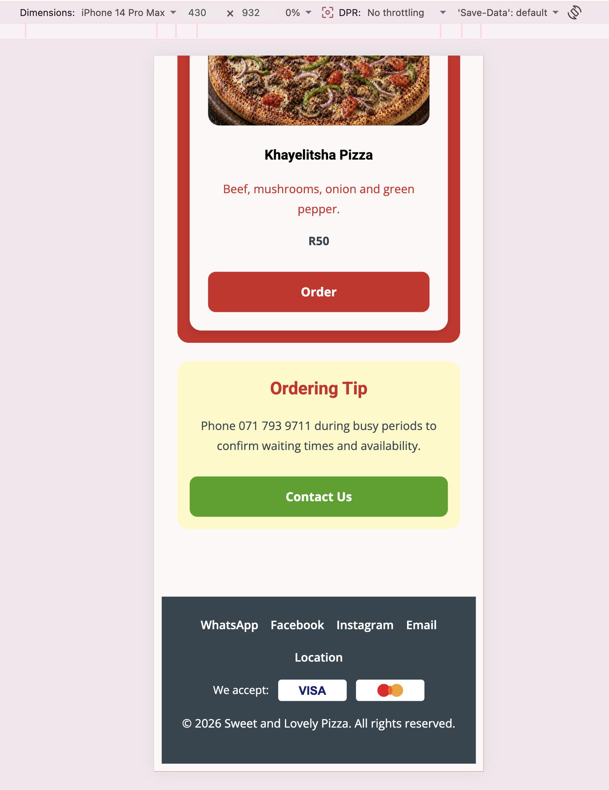

# Sweet and Lovely Pizza

## Part 1

Website created for Sweet and Lovely Pizza.

---

# Part 2 – CSS Styling and Responsive Design

For Part 2, the Sweet and Lovely Pizza website was improved through the implementation of CSS styling and responsive web design principles. Further updates in Part 3 refined the layout, content, and styling across all pages.

## Changelog

### Part 2 – Initial CSS and Responsive Design

* Created external stylesheet named `style.css`
* Linked all pages to external CSS
* Added responsive navigation styling
* Added media queries for mobile and tablet screens
* Improved typography and page layout
* Added Flexbox layouts for responsive sections
* Styled buttons, cards, and product layouts
* Added hover effects and spacing improvements
* Improved responsiveness across desktop, tablet, and mobile devices

### Part 3 – Layout, Styling and Content Updates

#### Home Page (`index.html`)

* Added product images to Popular Orders cards (Khayelitsha Pizza, Meat Lovers Pizza, 1KG Ribs & Chips)
* Updated Popular Orders buttons to **Order Now** and linked them to `menu.html`
* Styled Welcome and Popular Orders sections with red containers and Customer Safety with a light yellow container
* Removed box shadows and coloured side borders from home page containers
* Centred Welcome text, Popular Orders heading, and Customer Safety content
* Moved the header into the Welcome hero section with the pizza banner as the background
* Placed the business name on the left and navigation links on the right, with green hover effects
* Added a CSS-only collapsible navigation menu for mobile and tablet screen sizes (no JavaScript)
* Styled Popular Orders card titles in black and descriptions in red

#### About Page (`about.html`)

* Applied the shared page hero layout with banner background and responsive navigation
* Added a white card container inside the **Who We Are** section
* Fixed the compressed **Who We Are** image sizing
* Styled **What We Offer** cards with black headings, red descriptions, and centred text and buttons
* Reformatted **Customer Safety** and **Why Choose Us** as centred sentences without bullet points
* Updated **Visit or Order** with green **Contact Us** and **Order Now** buttons
* Removed bold styling from the business name in the welcome text

#### Menu Page (`menu.html`)

* Applied the shared page hero layout across the site
* Matched menu card text styling to **What We Offer** (black headings, red descriptions, centred content)
* Changed the **View Extras** button to green

#### Extras Page (`extras.html`)

* Applied the shared page hero layout
* Matched **Popular Packages** card text styling to the menu and about page cards
* Changed the **Order Now** button in **Extras & Combo Meals** to link to `menu.html`
* Reformatted **Extra Pizza Toppings** using the same styled card layout as Opening Hours on the contact page

#### Contact Page (`contact.html`)

* Applied the shared page hero layout
* Reorganised **Opening Hours** and **Our Details** into styled white card containers
* Changed the **Call Us** button to green
* Matched **Pickup and Safety Information** to the **Customer Safety** layout on the about page
* Updated the **Send Message** button to match standard button sizing

#### Checkout Page (`checkout.html`)

* Applied the shared page hero layout
* Matched **Ordering Safety Tips** to the **Customer Safety** layout on the about page
* Added a white payment method container with black text for Cash and Card options
* Styled **Place Order** and **Back To Menu** buttons to match the red and green button styles used elsewhere

#### Footer (All Pages)

* Added social media links (WhatsApp, Facebook, Instagram, Email, and Location)
* Added Visa and Mastercard payment icons

#### CSS and Assets

* Added shared classes including `site-page`, `page-hero`, `styled-cards`, `about-story`, and `payment-card`
* Added `visa.svg` and `mastercard.svg` payment icons in the `images/` folder
* Removed side borders from safety box containers
* Implemented mobile navigation using a checkbox and label toggle (CSS only)

---

# Responsive Testing Evidence

The website was tested using browser developer tools at common desktop, tablet, and mobile viewport sizes. Screenshots were captured to show how the layout, navigation, cards, and footer adapt across screen sizes.

## Desktop View

**Test viewport:** 1920 x 1080 (Samsung S33GF 24" simulation)

### Desktop Responsiveness 1

**Screenshot size:** 2913 x 1772 px

Home page layout showing the hero section with horizontal navigation, Welcome content, Popular Orders cards in a three-column grid, and the Customer Safety section.



### Desktop Responsiveness 2

**Screenshot size:** 2917 x 1776 px

Contact page layout showing the Send Us a Message form, stacked input fields, Send Message button, and footer with social links and payment icons.



---

## Tablet View

**Test viewport:** 820 x 1180 (iPad Air simulation)

### Tablet Responsiveness 1

**Screenshot size:** 1445 x 1972 px

Menu page top section showing the hero banner, Our Pizza Collection intro, green View Extras button, and two pizza cards displayed side by side.



### Tablet Responsiveness 2

**Screenshot size:** 1455 x 1966 px

Menu page lower section showing pizza cards in a two-column layout, the Ordering Tip safety box, and the site footer.



---

## Mobile View

**Test viewport:** 430 x 932 (iPhone 14 Pro Max simulation)

### Mobile Responsiveness 1

**Screenshot size:** 1501 x 1968 px

Menu page on mobile showing the collapsible hamburger navigation, stacked Our Pizza Collection section, and a single pizza card filling the screen width.



### Mobile Responsiveness 2

**Screenshot size:** 1526 x 1975 px

Menu page lower section on mobile showing a stacked pizza card, Ordering Tip section, and footer links with Visa and Mastercard icons.



---

# Sweet & Lovely Pizza Website

## Student Information

Name: Ayema Ngxabazi
Student Number: ST10519436
Module: WEDE5010
Lecturer: Mr Motau
Year: 2026

---

## Project Overview

This project is a multi-page website created for Sweet & Lovely Pizza. The website was developed using HTML and CSS and is designed to display menu items, prices, combo meals, and business information in a clear and organised way.

---

## Website Goals

* To create a simple and user-friendly website
* To display pizza menu items and prices
* To create a responsive website for desktop, tablet, and mobile users
* To improve customer communication through contact information and action buttons

---

## Pages Included

* Home (`index.html`)
* About (`about.html`)
* Menu (`menu.html`)
* Extras (`extras.html`)
* Checkout (`checkout.html`)
* Contact (`contact.html`)

---

## Project Structure

```text
SWEETANDLOVELYPIZZA 2 (1)/
│
├── images/
│   ├── desktop-responsiveness-1.png
│   ├── desktop-responsiveness-2.png
│   ├── tablet-responsiveness-1.png
│   ├── tablet-responsiveness-2.png
│   ├── mobile-responsiveness-1.png
│   ├── mobile-responsiveness-2.png
│   ├── pizza-tikka.png
│   └── pizza-vegetarian.png
│
├── about.html
├── checkout.html
├── contact.html
├── extras.html
├── index.html
├── menu.html
├── README.md
│
└── css/
    └── style.css
```

---

## How to Run the Project

Open the `index.html` file in a web browser to view the website.

---

## References

Uber Eats. (2026). *Sweet and Lovely Pizza menu*. Available at: https://www.ubereats.com/store-browse-uuid/24501827-e966-51ae-937a-59cbb14cdf70 (Accessed: 19 April 2026).

OpenAI. (2026). *AI-generated images used for Sweet and Lovely Pizza website*. Available at: https://chat.openai.com (Accessed: 27 April 2026).

Visual Studio Code. Available at: https://code.visualstudio.com/

GitHub. Available at: https://github.com/

---

## Declaration

This project is my own work. External sources were used only for images and inspiration.
