# Sweet and Lovely Pizza

## Part 1

Website created for Sweet and Lovely Pizza.

---

# Part 2 – CSS Styling and Responsive Design

For Part 2, the Sweet and Lovely Pizza website was improved through the implementation of CSS styling and responsive web design principles.

## Changelog

* Created external stylesheet named `style.css`
* Linked all pages to external CSS
* Added responsive navigation styling
* Added media queries for mobile and tablet screens
* Improved typography and page layout
* Added Flexbox layouts for responsive sections
* Styled buttons, cards, and product layouts
* Added hover effects and spacing improvements
* Improved responsiveness across desktop, tablet, and mobile devices

---

# Responsive Testing Evidence

## Desktop View

### Home Page

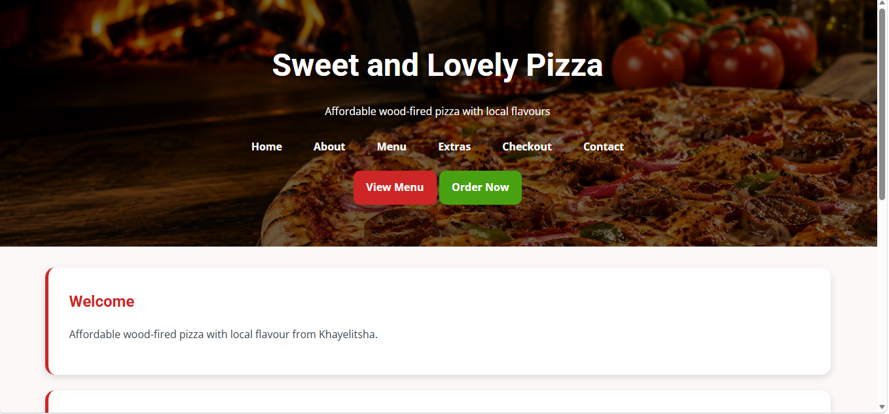

### Menu Page

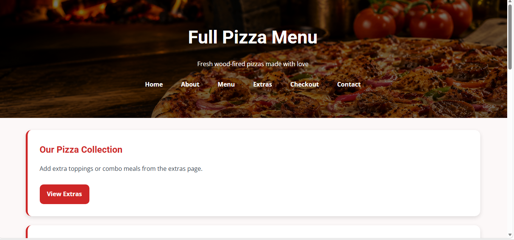

### Extras Page

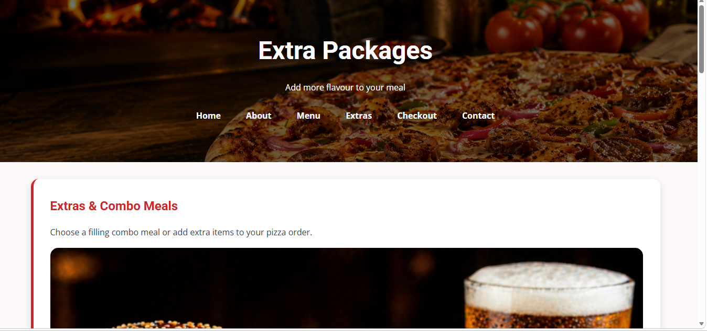

### Contact Page

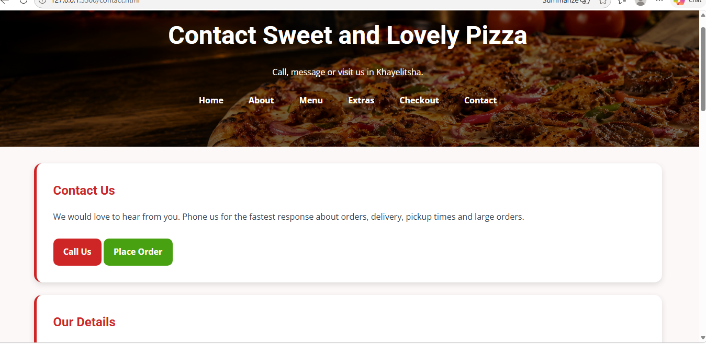

---

## Tablet View

### Home Page

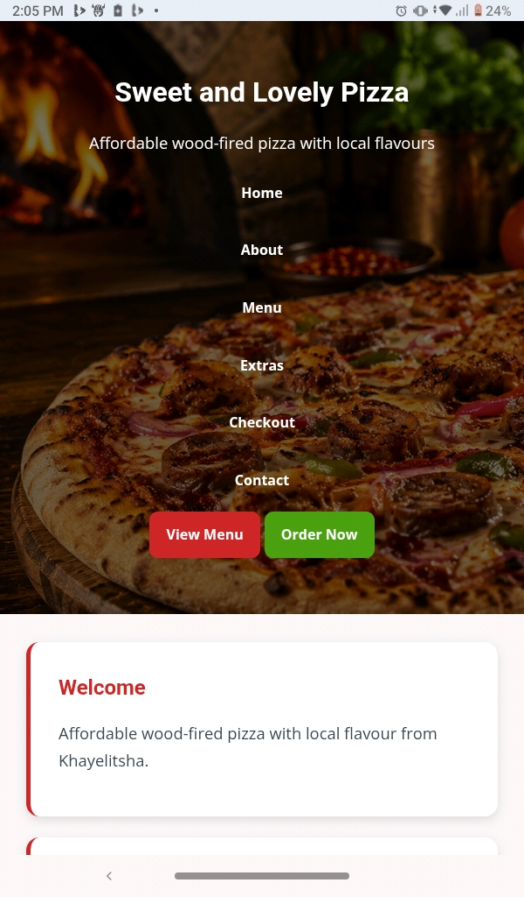

### Menu Page

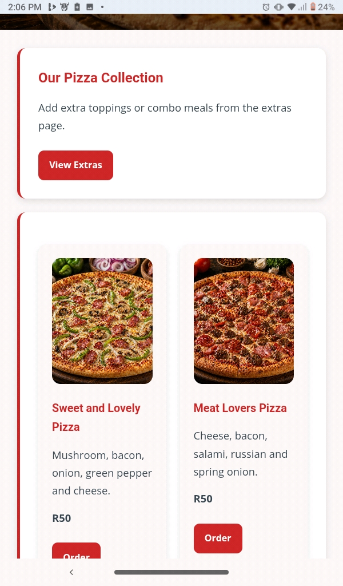

### Extras Page


### Contact Page

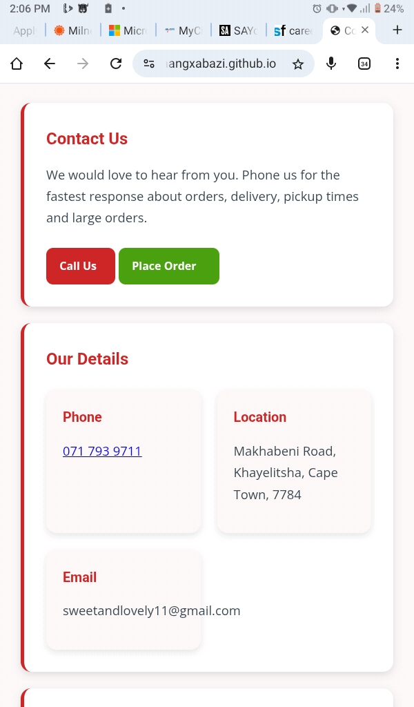

### Responsive iPad Layout

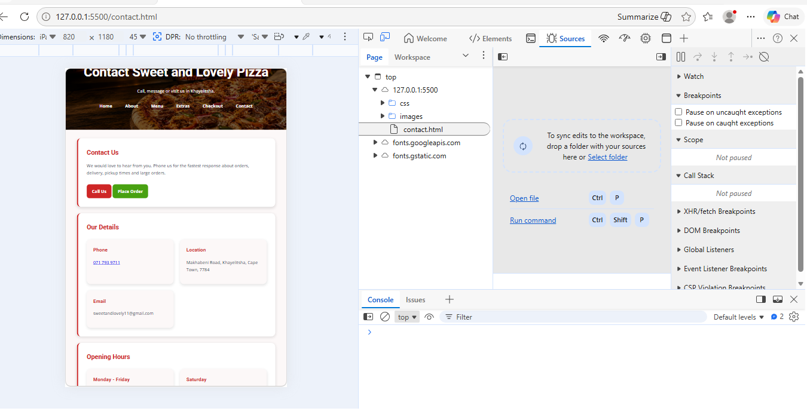

---

## Mobile View

### Home Page

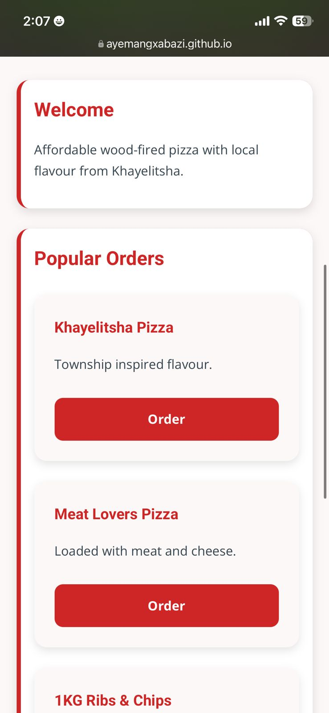

### Menu Page

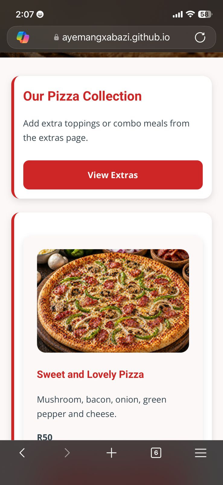

### Extras Page

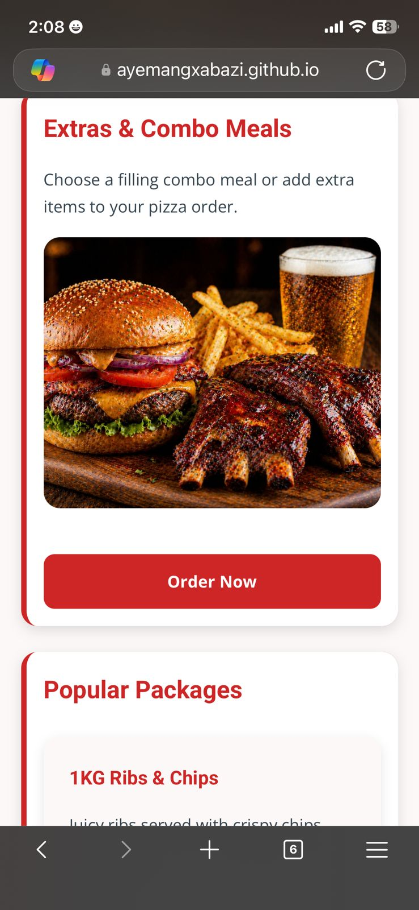

### Contact Page

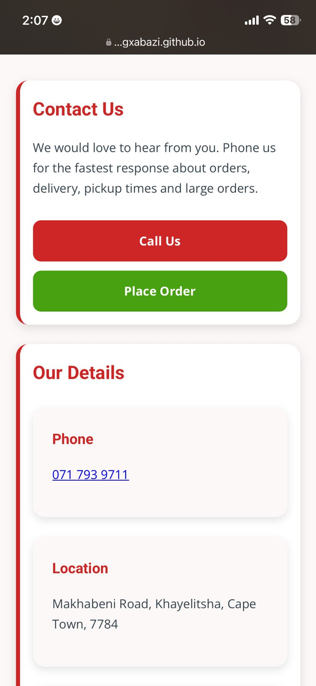

### Responsive iPhone Layout

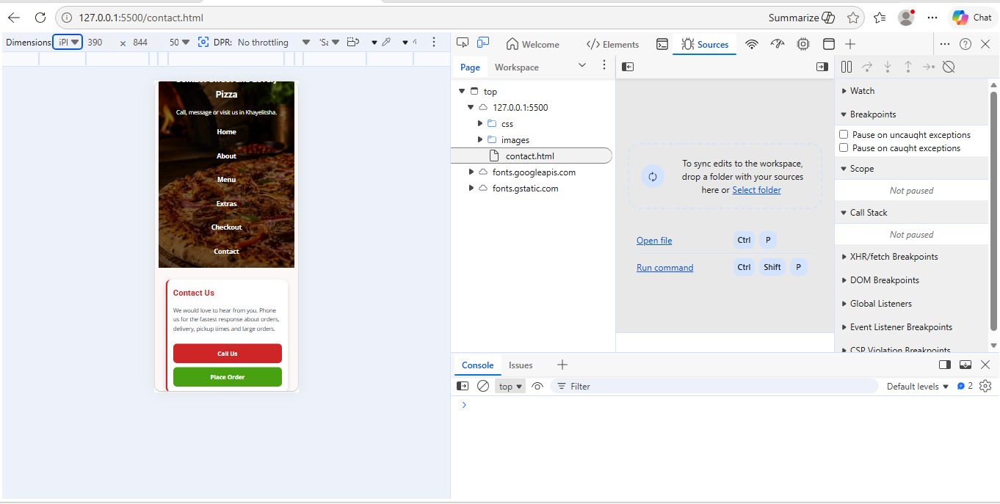

---

# 🍕 Sweet & Lovely Pizza Website

## Student Information

Name: Ayema Ngxabazi
Student Number: ST10519436
Module: WEDE5010
Lecturer: Mr Motau
Year: 2026

---

## Project Overview

This project is a multi-page website created for Sweet & Lovely Pizza. The website was developed using HTML and CSS and is designed to display menu items, prices, combo meals, and business information in a clear and organised way.

---

## Website Goals

* To create a simple and user-friendly website
* To display pizza menu items and prices
* To create a responsive website for desktop, tablet, and mobile users
* To improve customer communication through contact information and action buttons

---

## Pages Included

* Home (`index.html`)
* About (`about.html`)
* Menu (`menu.html`)
* Extras (`extras.html`)
* Checkout (`checkout.html`)
* Contact (`contact.html`)

---

## Project Structure

```text
sweet-and-lovely-pizza/
│
├── index.html
├── about.html
├── menu.html
├── extras.html
├── checkout.html
├── contact.html
├── README.md
│
├── css/
│   └── style.css
│
├── images/
│
└── Screenshots/
```

---

## How to Run the Project

Open the `index.html` file in a web browser to view the website.

---

## References

Uber Eats. (2026). *Sweet and Lovely Pizza menu*. Available at: https://www.ubereats.com/store-browse-uuid/24501827-e966-51ae-937a-59cbb14cdf70 (Accessed: 19 April 2026).

OpenAI. (2026). *AI-generated images used for Sweet and Lovely Pizza website*. Available at: https://chat.openai.com (Accessed: 27 April 2026).

Visual Studio Code. Available at: https://code.visualstudio.com/

GitHub. Available at: https://github.com/

---

## Declaration

This project is my own work. External sources were used only for images and inspiration.
